<p align="center">

  <h2 align="center">PhysRVG: Physics-Aware Unified Reinforcement Learning for Video Generative Models</h2>
  <p align="center">
    <a href=""><strong>Qiyuan Zhang</strong></a>
    ·
    <a href="https://scholar.google.com/citations?user=BwdpTiQAAAAJ"><strong>Biao Gong</strong></a>
    ·
    <a href=""><strong>Shuai Tan</strong></a>
    ·
    <a href=""><strong>Zheng Zhang</strong></a>
    <br>
    <a href=""><strong>Yujun Shen</strong></a>
    ·
    <a href=""><strong>Xing Zhu</strong></a>
    ·
    <a href=""><strong>Yuyuan Li</strong></a>
    ·
    <a href=""><strong>Kelu Yao</strong></a>
    ·
    <a href=""><strong>Chunhua Shen</strong></a>
    ·
    <a href=""><strong>Changqing Zou</strong></a>       
    <br>
    <br>
        <a href="https://arxiv.org/abs/2601.11087"></a>
        <a href='https://lucaria-academy.github.io/PhysRVG/'></a>
        <a href='https://huggingface.co/papers/2601.11087'></a>
    <br>
    <b></a>Ant Group</b>
    <br>
  </p>
</p>

This repository is the official implementation of paper "PhysRVG: Physics-Aware Unified Reinforcement Learning for Video Generative Models". We leverage a unified reinforcement learning framework and **verifiable rewards** to improve **rigid-body motion** generation in video synthesis.
  <table align="center">
    <tr>
    <td>
      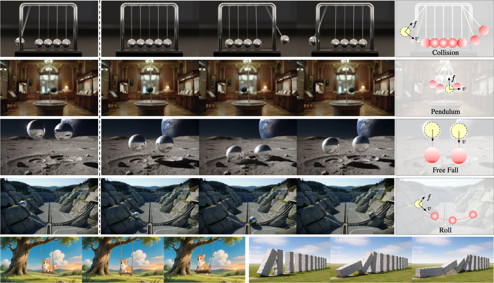
    </td>
    </tr>
  </table>


## &#x1F4E2; News

* **Jun 27, 2026** — PhysRVG is accepted to **ECCV 2026**! &#x1F389;
* **Jun 23, 2026** — Training and inference code released.
* **Jun 22, 2026** — Model weights released on [Hugging Face](https://huggingface.co/HappyP4nda/PhysRVG).
* **Jan 16, 2026** — Paper released on [arXiv](https://arxiv.org/abs/2601.11087).


## &#x1F3AC; Gallery

PhysRVG generates physically-plausible rigid-body dynamics across four canonical motion types. See more demos on our [Project Page](https://lucaria-academy.github.io/PhysRVG/).

<!-- These looping GIFs are generated from asset/*.mp4 and render inline on github.com (relative-path
     images are supported, unlike <video>). Regenerate with:
     ffmpeg -i asset/x.mp4 -vf "fps=12,scale=320:-2:flags=lanczos,split[s0][s1];[s0]palettegen[p];[s1][p]paletteuse" -loop 0 asset/x.gif -->
<table align="center">
  <tr>
    <td align="center"><b>Collision</b></td>
    <td align="center"><b>Collision</b></td>
    <td align="center"><b>Free Fall</b></td>
    <td align="center"><b>Free Fall</b></td>
  </tr>
  <tr>
    <td>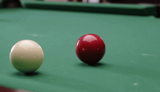</td>
    <td>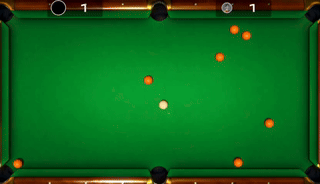</td>
    <td>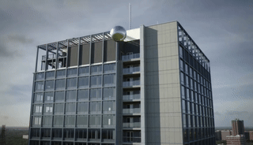</td>
    <td>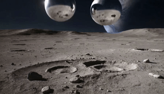</td>
  </tr>
  <tr>
    <td align="center"><b>Pendulum</b></td>
    <td align="center"><b>Pendulum</b></td>
    <td align="center"><b>Rolling</b></td>
    <td align="center"><b>Rolling</b></td>
  </tr>
  <tr>
    <td>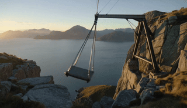</td>
    <td></td>
    <td>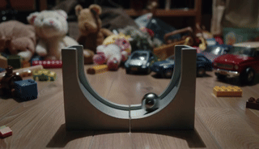</td>
    <td>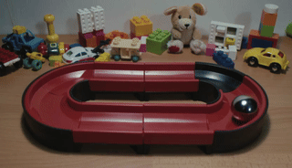</td>
  </tr>
</table>

<p align="center"><b>Downstream Application: Billiards Game</b></p>
<table align="center">
  <tr>
    <td><video src="https://github.com/user-attachments/assets/3dc52936-66a9-46a4-9934-76967045f81d" autoplay loop muted playsinline controls width="720"></video></td>
  </tr>
  <tr>
    <td align="center"><i>PhysRVG powers a physically-consistent billiards game, where ball trajectories and collisions follow real-world dynamics.</i></td>
  </tr>
</table>


## &#x1F680; Environment
```bash
conda create -n physrvg python=3.10.13
conda activate physrvg
cd PhysRVG
pip install -e .
```


## &#x1F680; Download Checkpoint

Download PhysRVG CKPT from [Hugging Face](https://huggingface.co/HappyP4nda/PhysRVG) into the `./models` directory, which should be like:
```
./models/
|---- dit
|---- lora
|---- sam2.1-hiera-large
└---- Wan2.2-TI2V-5B-Diffusers
```

## &#x1F4A1; Inference 

We provide two examples in the `./data` folder, and the output videos are saved in the `./output` folder.


```bash
python inference.py --video_path data/example_videos/2/video.mp4
```


## &#x1F525; Train

Launch RL fine-tuning with the example data in `./data` on 1 node with 8 GPUs. Results and rollouts are saved in `./exp`.

```bash
bash scripts/finetune/train_rl.sh
```

<details>
<summary>&#x1F4DC; <b>Click to expand the detail</b></summary>

<br>

The script `scripts/finetune/train_rl.sh` is annotated below — each key argument explains *what it does* and *how to tune it*:

```bash
torchrun --nnodes=1 --nproc_per_node=8 \     # 1 node, 8 GPUs; set --nproc_per_node to your GPU count
    fastvideo/train_wan_rl.py \
    --reward_type position \
    --reward_model_path <model_path> \
    --model_id <model_path> \
    --resume_from_checkpoint <model_path> \
    --data_json_path data/data.jsonl \
    --data_repeat 1000 \
    --exp_name physrvg \
    --output_dir exp \                       # exp is saved to {output_dir}/{exp_name}-{timestamp}
    --seed 42 \
    --train_batch_size 1 \                   # fixed at 1
    --gradient_accumulation_steps 4 \        # accumulate grads over N steps before each update (effectively a larger batch)
    --gradient_checkpointing \
    --learning_rate 1e-5 \                   # 1e-6 is recommended for full-parameter fine-tuning
    --weight_decay 0.0001 \
    --lr_warmup_steps 0 \
    --max_grad_norm 1.0 \
    --train_epoch 99999 \
    --max_train_steps 999999 \
    --checkpointing_steps 20 \
    --checkpoints_total_limit 2 \            # keep only the latest N checkpoints on disk
    --dataloader_num_workers 4 \
    --guidance_scale 5 \                     # no CFG by default; to enable CFG, add --do_cfg
    --sampling_steps 8 \                     # V2V has a stronger condition, so 8 denoising steps already give good results
    --num_frames 49 \
    --height 480 --width 832 \
    --fps 15 \
    --eta 1.0 \                              # controls the noise intensity, i.e. the strength of RL exploration
    --timestep_fraction 1.0 \
    --num_generations 4 \                    # number of samples generated per prompt
    --bestofn 4 \                            # use the n most extreme samples to compute the RL loss
    --use_same_noise \                       # recommended; sharing the same noise greatly improves training stability
    --collision_loss_weight \                # switch for whether to use collision detection
    --hybrid_train \                         # switch for enabling MDCycle
    --hybrid_train_threshold 10.0 \          # trigger SFT when loss > hybrid_train_threshold
    --start_max 8 \
    --use_lora                               # disable to run full-parameter training
```

> **Note:** RL training for video generation is **hard to converge**. In our paper, convergence required `num_generations=20`, `bestofn=12`, LoRA, and **32 GPUs**.

</details>


## &#x1F9F9; Data Preprocess

Each training sample requires a `video` and an `info.jsonl` that specifies the **2D coordinates of the two interacting objects** on the first frame. These points can be obtained with [Grounding DINO](https://github.com/IDEA-Research/GroundingDINO) or labeled manually — here we use manual annotation. The `info.jsonl` looks like:

```json
{"object_1": [220, 210], "object_2": [325, 270]}
```

Given the points, we run [SAM 2](https://github.com/facebookresearch/sam2) to segment and track each object across all frames, producing a binary mask video per object:

```bash
python preprocess/preprocess.py --video preprocess/example/video.mp4 --info preprocess/example/info.jsonl
```

The point prompts (left) guide SAM 2 to track each object and output its mask video (right):

<table align="center">
  <tr>
    <td align="center"><b>Input: Video + Points</b></td>
    <td align="center"><b>Output: Mask (object_1)</b></td>
    <td align="center"><b>Output: Mask (object_2)</b></td>
  </tr>
  <tr>
    <td>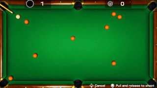</td>
    <td>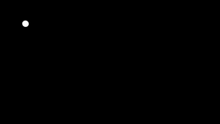</td>
    <td>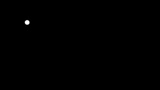</td>
  </tr>
  <tr>
    <td align="center"><i>object_1 = [220, 210], object_2 = [325, 270]</i></td>
    <td align="center"><i>tracked from [220, 210]</i></td>
    <td align="center"><i>tracked from [325, 270]</i></td>
  </tr>
</table>

After a successful run, the masks are saved next to the input video:

```
preprocess/example/
|---- video.mp4              # input video
|---- info.jsonl             # object_1 / object_2 points
|---- mask_object_1.mp4      # generated mask for object_1
└---- mask_object_2.mp4      # generated mask for object_2
```


## Acknowledgement
Our implementation is based on [FlowGRPO](https://github.com/yifan123/flow_grpo), [DanceGRPO](https://github.com/XueZeyue/DanceGRPO). Thanks for their remarkable contribution and released code!


## Citation
If you find this codebase useful for your research, please use the following entry.
```BibTeX
@article{PhysRVG2026,
  title={PhysRVG: Physics-Aware Unified Reinforcement Learning for Video Generative Models},
  author={Zhang, Qiyuan and Gong, Biao and Tan, Shuai and Zhang, Zheng and Shen, Yujun and Zhu, Xing and Li, Yuyuan and Yao, Kelu and Shen, Chunhua and Zou, Changqing},
  journal={ECCV 2026},
  year={2026}
}
```