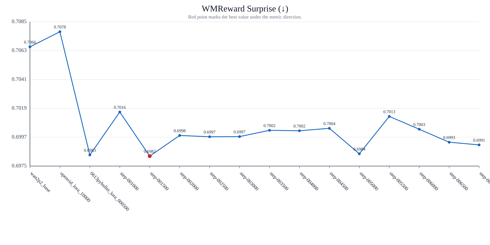
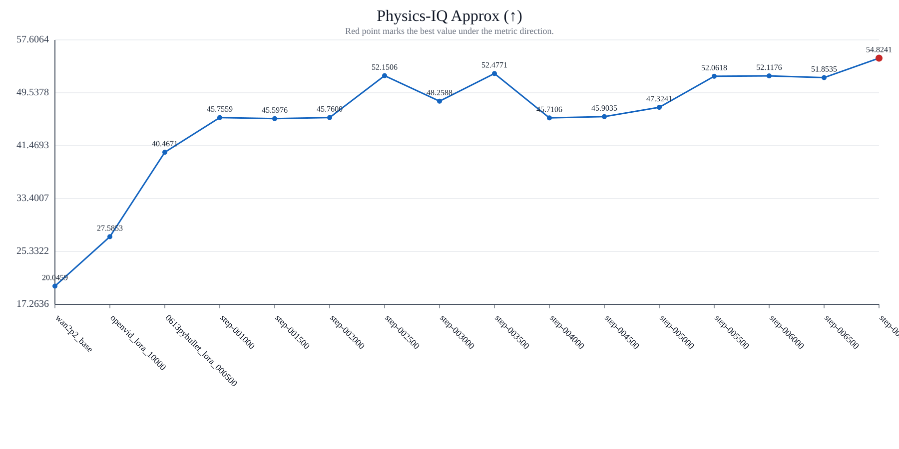
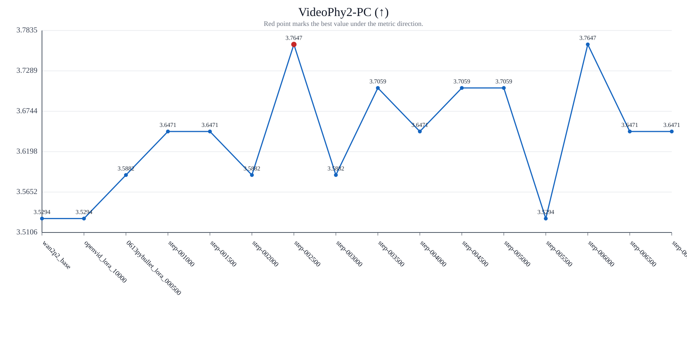
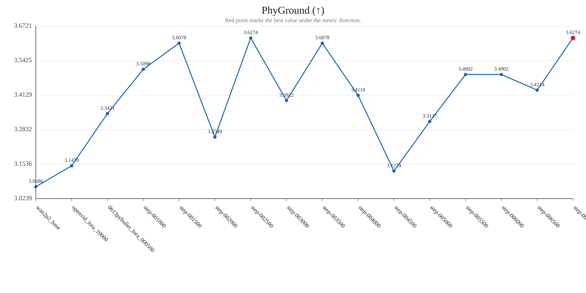
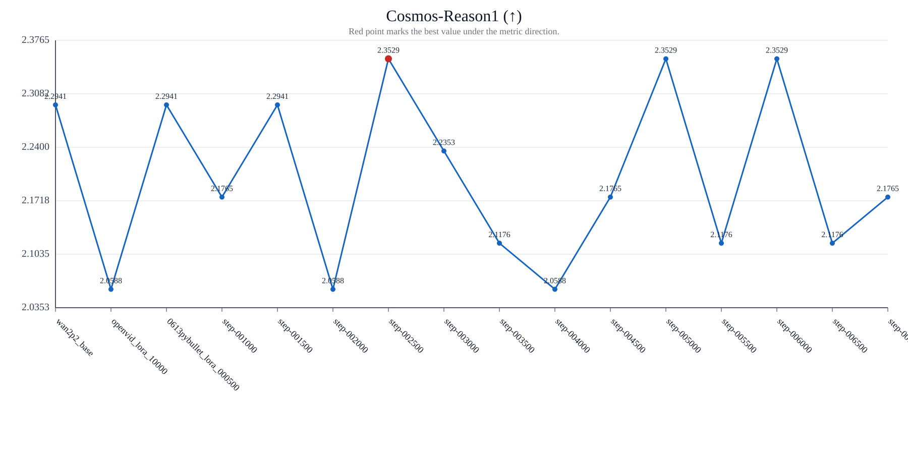

# train_stage1b_diffsynth_native0705_0705 aligned17 指标报告

## 基本信息

| 项目 | 值 |
| --- | --- |
| 测试集路径 | `/data/gaoya/AAA_test_video/0623/testjsons/train_stage1b_diffsynth_native0705_0705_step007000_17.txt` |
| 样本数量 | `17` |
| 汇总 CSV | `/data/gaoya/AAA_test_video/0623/test/report/v2v/groups/train_stage1b_diffsynth_native0705_0705_step007000_17/method_summary.csv` |
| 方法顺序 | `wan2p2_base, openvid_lora_10000, 0613pybullet_lora_000500, step-001000, step-001500, step-002000, step-002500, step-003000, step-003500, step-004000, step-004500, step-005000, step-005500, step-006000, step-006500, step-007000` |

## 指标方向

- `WMReward Surprise`: 越低越好
- `Physics-IQ Approx`: 越高越好
- `VideoPhy2-PC`: 越高越好
- `PhyGround`: 越高越好
- `Cosmos-Reason1`: 越高越好

## 指标表格

说明：表格中带 `★最佳` 的数值表示该指标当前最优结果；若有并列最优，会同时标出。

| 方法 | 数量 | WMReward Surprise (↓) | Physics-IQ Approx (↑) | VideoPhy2-PC (↑) | PhyGround (↑) | Cosmos-Reason1 (↑) | 测试集路径 |
| --- | ---: | ---: | ---: | ---: | ---: | ---: | --- |
| wan2p2_base | 17 | 0.706600 | 20.045882 | 3.529412 | 3.068618 | 2.294118 | `/data/gaoya/AAA_test_video/0623/testjsons/train_stage1b_diffsynth_native0705_0705_step007000_17.txt` |
| openvid_lora_10000 | 17 | 0.707759 | 27.585294 | 3.529412 | 3.147047 | 2.058824 | `/data/gaoya/AAA_test_video/0623/testjsons/train_stage1b_diffsynth_native0705_0705_step007000_17.txt` |
| 0613pybullet_lora_000500 | 17 | 0.698318 | 40.467059 | 3.588235 | 3.343147 | 2.294118 | `/data/gaoya/AAA_test_video/0623/testjsons/train_stage1b_diffsynth_native0705_0705_step007000_17.txt` |
| step-001000 | 17 | 0.701606 | 45.755882 | 3.647059 | 3.509800 | 2.176471 | `/data/gaoya/AAA_test_video/0623/testjsons/train_stage1b_diffsynth_native0705_0705_step007000_17.txt` |
| step-001500 | 17 | **0.698229** ★最佳 | 45.597647 | 3.647059 | 3.607841 | 2.294118 | `/data/gaoya/AAA_test_video/0623/testjsons/train_stage1b_diffsynth_native0705_0705_step007000_17.txt` |
| step-002000 | 17 | 0.699812 | 45.760000 | 3.588235 | 3.254894 | 2.058824 | `/data/gaoya/AAA_test_video/0623/testjsons/train_stage1b_diffsynth_native0705_0705_step007000_17.txt` |
| step-002500 | 17 | 0.699712 | 52.150588 | **3.764706** ★最佳 | 3.627429 | **2.352941** ★最佳 | `/data/gaoya/AAA_test_video/0623/testjsons/train_stage1b_diffsynth_native0705_0705_step007000_17.txt` |
| step-003000 | 17 | 0.699724 | 48.258824 | 3.588235 | 3.392159 | 2.235294 | `/data/gaoya/AAA_test_video/0623/testjsons/train_stage1b_diffsynth_native0705_0705_step007000_17.txt` |
| step-003500 | 17 | 0.700206 | 52.477059 | 3.705882 | 3.607841 | 2.117647 | `/data/gaoya/AAA_test_video/0623/testjsons/train_stage1b_diffsynth_native0705_0705_step007000_17.txt` |
| step-004000 | 17 | 0.700171 | 45.710588 | 3.647059 | 3.411759 | 2.058824 | `/data/gaoya/AAA_test_video/0623/testjsons/train_stage1b_diffsynth_native0705_0705_step007000_17.txt` |
| step-004500 | 17 | 0.700359 | 45.903529 | 3.705882 | 3.127447 | 2.176471 | `/data/gaoya/AAA_test_video/0623/testjsons/train_stage1b_diffsynth_native0705_0705_step007000_17.txt` |
| step-005000 | 17 | 0.698406 | 47.324118 | 3.705882 | 3.313718 | **2.352941** ★最佳 | `/data/gaoya/AAA_test_video/0623/testjsons/train_stage1b_diffsynth_native0705_0705_step007000_17.txt` |
| step-005500 | 17 | 0.701271 | 52.061765 | 3.529412 | 3.490200 | 2.117647 | `/data/gaoya/AAA_test_video/0623/testjsons/train_stage1b_diffsynth_native0705_0705_step007000_17.txt` |
| step-006000 | 17 | 0.700288 | 52.117647 | **3.764706** ★最佳 | 3.490194 | **2.352941** ★最佳 | `/data/gaoya/AAA_test_video/0623/testjsons/train_stage1b_diffsynth_native0705_0705_step007000_17.txt` |
| step-006500 | 17 | 0.699294 | 51.853529 | 3.647059 | 3.431382 | 2.117647 | `/data/gaoya/AAA_test_video/0623/testjsons/train_stage1b_diffsynth_native0705_0705_step007000_17.txt` |
| step-007000 | 17 | 0.699088 | **54.824118** ★最佳 | 3.647059 | **3.627441** ★最佳 | 2.176471 | `/data/gaoya/AAA_test_video/0623/testjsons/train_stage1b_diffsynth_native0705_0705_step007000_17.txt` |

## 指标可视化折线图

### WMReward Surprise (↓)

### Physics-IQ Approx (↑)

### VideoPhy2-PC (↑)

### PhyGround (↑)

### Cosmos-Reason1 (↑)

