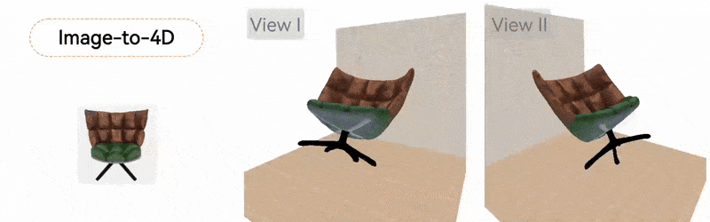

<p align="center">

  <h1 align="center"><color style="color: teal;">SOPHY</color>: Generating <color style="color: teal;">S</color>imulation-Ready <color style="color: teal;">O</color>bjects with <color style="color: teal;">PHY</color>sical Materials</h1>
  <p align="center">
    Junyi Cao
    ·
    Evangelos Kalogerakis
  </p>
  <h3 align="center"> <a href="https://arxiv.org/abs/2504.12684" target="_blank"> arXiv </a> &nbsp;&nbsp; | &nbsp;&nbsp; <a href="https://xjay18.github.io/SOPHY/" target="_blank"> Project Page </a> &nbsp;&nbsp; | &nbsp;&nbsp; <a href="#data"> Data </a></h3>
  <div align="center"></div>
</p>

<p align="center">
  <a href="">
    
  </a>
</p>

<p style="text-align:justify">
We present <color style="color: teal;">SOPHY</color>, a generative model for 3D physics-aware shape synthesis. Unlike existing 3D generative models that focus solely on static geometry or 4D models that produce physics-agnostic animations, our method jointly synthesizes shape, texture, and material properties related to physics-grounded dynamics, making the generated objects ready for simulations and interactive, dynamic environments. To train our model, we introduce a dataset of 3D objects annotated with detailed physical material attributes, along with an efficient pipeline for material annotation. Our method enables applications such as text-driven generation of interactive, physics-aware 3D objects and single-image reconstruction of physically plausible shapes. Furthermore, our experiments show that jointly modeling shape and material properties enhances the realism and fidelity of the generated shapes, improving performance on both generative geometry and physical plausibility.
</p>


**Please consider citing our paper if you find it interesting or helpful to your research.**
```
@inproceedings{Cao_2026_SOPHY,
    author      = {Cao, Junyi and Kalogerakis, Evangelos},
    title       = {{SOPHY}: Generating Simulation-Ready Objects with Physical Materials},
    booktitle   = {Winter Conference on Applications of Computer Vision (WACV)},
    year        = {2026}
}
```

---

### Basic Requirements
Please ensure that you have already installed the following packages.
- **General requirements**
  ```
  git clone https://github.com/XJay18/SOPHY.git
  cd SOPHY
  pip install -r requirements.txt
  ```

- **triangle_hash**
  ```
  cd dynamics/util/extern/libmesh

  python setup.py build_ext --inplace
  ```

- **Open CLIP**
  ```
  pip install open-clip-torch==3.2.0
  ```

- **nvdiffrast**
  Please refer to the [official document](https://nvlabs.github.io/nvdiffrast/#installation) to install this package. We used the version `0.3.3` in our experiments.

- **ManifoldPlus**
  Please follow the install requirements posted on the [official repo](https://github.com/hjwdzh/ManifoldPlus). After building the executable file, you need to specify the value of `MANIFOLD_PLUS` in `dynamics/util/constants.py` to the path of the executable file, e.g., `ManifoldPlus/build/manifold`

- **Hunyuan3D-2**
  Please follow the install requirements posted on the [official repo](https://github.com/Tencent-Hunyuan/Hunyuan3D-2?tab=readme-ov-file#install-requirements). We used the commit `03cb05a50881cf025b9368aa5f7396cfaaf8ccab` in our experiments.

### Data

We provide our dataset [here](https://umass-my.sharepoint.com/:f:/g/personal/junyicao_umass_edu/IgAkVfjY9oJqTZEUnk4mN2JDAQoGlrZ4degbUrselp7gWOY). The total size of the zipped files is about 90G. Please download the dataset before running the scripts in the following sections. We assume the dataset is saved in `DATA_PATH`.

**Important!**: You should edit the `DATA_PATH` variables in `dynamics/util/constants.py` and `geometry/util/constants.py`.

<details>
<summary>Example data structure after unzipping</summary>

```
DATA_PATH
├── data
│   ├── test
│   ├── train
│   └── valid
└── simulation_data
    ├── test
    ├── train
    └── valid
```
</details>

<details>
<summary>Check md5sum here</summary>

```
47555a87b470acc9dc19e41e9d0b8794  bag.zip
ec57e353083b743ced8e26ec18f4c1f3  bed.zip
f3e66d374a6e2e31968ee3e03454778d  chair.zip
1306e7dbecc97b8fa0982556deacab48  crib.zip
1f872db61e96ab56551557b2e8a16454  planter.zip
2a1d3ddcd98f78cdf6edcfd36c8acde7  hat.zip
0d31cc18911e3576f032a19cc22dae37  headband.zip
31b9f3d279ba1940a2fa91b839a54055  love_seat.zip
484460dab4a2d43b3182c412903d6e15  pillow.zip
b70a9155137f701b173c6ecfbe012443  sofa.zip
7f98c0fb5f29d4531621ad120e6f007a  teddy_bear.zip
407cdbf734e3b0f6538f66e3bf343126  vase.zip
```

</details>


Note: The rendered images of the original 3D objects are saved in `data/` folder while the meshes and the material parameters are saved in `simulation_data` folder.

### Checkpoints

Please download the checkpoints of the Autoencoder and Conditional Diffusion Models [here](https://umass-my.sharepoint.com/:f:/g/personal/junyicao_umass_edu/IgCJjc9XG3nuSo1sZ1k3bUoqATr6lM95NDXHe0nwEel_QTM).
Create a directory `geometry/output` and put the files there. 

<details>
<summary>Example data structure</summary>

```
geometry/output
├── ae
│   └── shared
│       └── checkpoint-0.pth
├── dm
│   ├── shared_image
│   │   └── checkpoint-0.pth
│   └── shared_text
│       └── checkpoint-0.pth
├── data_static.json    # (camera view template)
├── sampled-image.json  # (sampled image-generation ids)
└── sampled-text.json   # (sampled text-generation ids)
```

</details>

### Geometry Inference (3D Generation)
1. **Image-conditioned Generation**
Run the following script for image-conditioned 3D generation. We assume the current folder is `SOPHY/`.
```
cd geometry
export PYTHONPATH=$PWD

python generate_image_cond.py \
    --ae-pth output/ae/shared/checkpoint-0.pth \
    --dm-pth output/dm/shared_image/checkpoint-0.pth \
    --num_samples_per_cond 1 \
    --cond_version eval \
    --cond_path v2
```

2. **Text-conditioned Generation**
Run the following script for text-conditioned 3D generation. We assume the current folder is `SOPHY/`.
```
cd geometry
export PYTHONPATH=$PWD

python generate_text_cond.py \
    --ae-pth output/ae/shared/checkpoint-0.pth \
    --dm-pth output/dm/shared_text/checkpoint-0.pth \
    --num_samples_per_cond 1 \
    --cond_version eval \
    --cond_path v2
```

Note: After running the code above, you should get the generated 3D objects under `output/obj/shared_*/v2/meshes-0`, and the generated physical material parameters under `output/obj/shared_*/v2/mats-0`

### Post Processing 3D Generation
1. Run the following script after generating 3D objects for **texture enhancement**. We assume the current folder is `SOPHY/`.
```
cd geometry
export PYTHONPATH=$PWD

python texture_enhance.py --mesh_dir output/obj/shared_image/v2/meshes-0

python texture_enhance.py --mesh_dir output/obj/shared_text/v2/meshes-0
```

2. Run the following script after texture enhancement to link the generated assets to a cache directory for subsequent dynamic generation. We assume the current folder is `SOPHY/`.
```
cd geometry
export PYTHONPATH=$PWD

python link_generated_data.py --mesh_dir output/obj/shared_image/v2/meshes-0 --mode dm

python link_generated_data.py --mesh_dir output/obj/shared_text/v2/meshes-0 --mode dm
```

Note: After the linking stage, you should get a new directory `generated_cache` under `DATA_PATH` (i.e., the diretory of the dataset)

### Dynamics Inference (4D Generation)
Run the following script for 4D generation after completing the above steps. We assume the current folder is `SOPHY/`.

```
cd dynamics
export PYTHONPATH=$PWD

python action/drop.py --target_name dm-shared_image-v2-meshes_0 --split test --indices ae_02b --save_meshes --save_mp4 --vis_bbox
```

```
cd dynamics
export PYTHONPATH=$PWD

python action/drop.py --target_name dm-shared_text-v2-meshes_0 --split test --indices 0c_3b9 --save_meshes --save_mp4 --vis_bbox
```

Note: The generated videos can be found at `$DATA_PATH/generated_cache/dm-shared_*-v2-meshes_0/gen_data/test/$CATEGORY/$OBJ_ID/*.mp4`

Note: You can replace `action/drop.py` with `action/throw.py` or `action/tilt.py` for other actions.

---

Please feel free to contact Junyi Cao (xjay2018@gmail.com) if you have any questions about this work.
